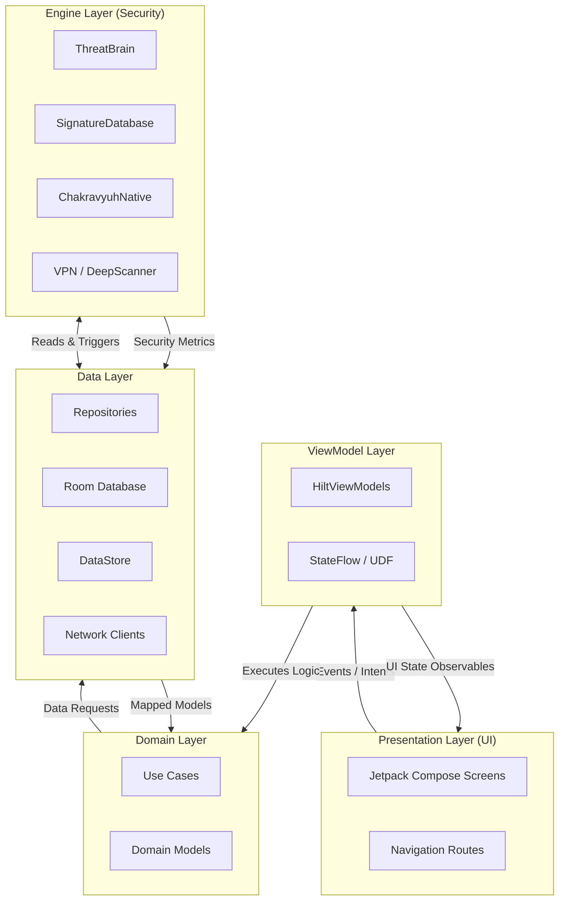

```mermaid
graph TD
    subgraph UI["Presentation Layer (UI)"]
        A1[Jetpack Compose Screens]
        A2[Navigation Routes]
    end

    subgraph VM["ViewModel Layer"]
        B1[HiltViewModels]
        B2[StateFlow / UDF]
    end

    subgraph Domain["Domain Layer"]
        C1[Use Cases]
        C2[Domain Models]
    end

    subgraph Data["Data Layer"]
        D1[Repositories]
        D2[Room Database]
        D3[DataStore]
        D4[Network Clients]
    end

    subgraph Engine["Engine Layer (Security)"]
        E1[ThreatBrain]
        E2[SignatureDatabase]
        E3[ChakravyuhNative]
        E4[VPN / DeepScanner]
    end

    UI -->|Events / Intents| VM
    VM -->|UI State Observables| UI
    VM -->|Executes Logic| Domain
    Domain -->|Data Requests| Data
    Data -->|Mapped Models| Domain
    Data <-->|Reads & Triggers| Engine
    Engine -->|Security Metrics| Data
```
