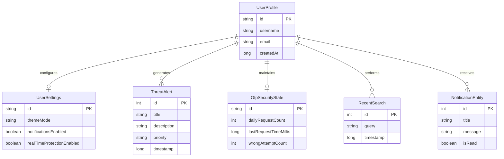

```mermaid
erDiagram
    UserProfile {
        string id PK
        string username
        string email
        long createdAt
    }
    UserSettings {
        string id PK
        string themeMode
        boolean notificationsEnabled
        boolean realTimeProtectionEnabled
    }
    ThreatAlert {
        int id PK
        string title
        string description
        string priority
        long timestamp
    }
    OtpSecurityState {
        string id PK
        int dailyRequestCount
        long lastRequestTimeMillis
        int wrongAttemptCount
    }
    RecentSearch {
        int id PK
        string query
        long timestamp
    }
    NotificationEntity {
        int id PK
        string title
        string message
        boolean isRead
    }

    UserProfile ||--o| UserSettings : "configures"
    UserProfile ||--o{ ThreatAlert : "generates"
    UserProfile ||--o| OtpSecurityState : "maintains"
    UserProfile ||--o{ RecentSearch : "performs"
    UserProfile ||--o{ NotificationEntity : "receives"
```
