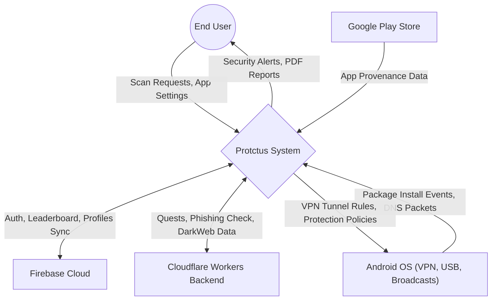

```mermaid
graph TD
    U((End User))
    OS["Android OS (VPN, USB, Broadcasts)"]
    GP["Google Play Store"]
    FB["Firebase Cloud"]
    CW["Cloudflare Workers Backend"]

    Sys{"Protctus System"}

    U -->|Scan Requests, App Settings| Sys
    Sys -->|Security Alerts, PDF Reports| U

    GP -->|App Provenance Data| Sys

    Sys <-->|Auth, Leaderboard, Profiles Sync| FB
    Sys <-->|Quests, Phishing Check, DarkWeb Data| CW

    OS -->|Package Install Events, DNS Packets| Sys
    Sys -->|VPN Tunnel Rules, Protection Policies| OS
```
