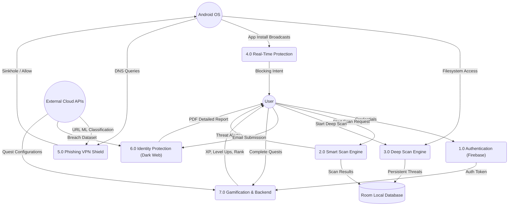

```mermaid
graph TD
    U((User))
    OS((Android OS))
    Ext((External Cloud APIs))

    P1("1.0 Authentication (Firebase)")
    P2("2.0 Smart Scan Engine")
    P3("3.0 Deep Scan Engine")
    P4("4.0 Real-Time Protection")
    P5("5.0 Phishing VPN Shield")
    P6("6.0 Identity Protection (Dark Web)")
    P7("7.0 Gamification & Backend")

    DB[(Room Local Database)]

    U -->|Credentials| P1
    P1 -->|Auth Token| P7

    U -->|Start Scan Request| P2
    P2 -->|Scan Results| DB
    P2 -->|Threat Alerts| U

    U -->|Start Deep Scan| P3
    OS -->|Filesystem Access| P3
    P3 -->|Persistent Threats| DB

    OS -->|App Install Broadcasts| P4
    P4 -->|Blocking Intent| U

    OS -->|DNS Queries| P5
    Ext -->|URL ML Classification| P5
    P5 -->|Sinkhole / Allow| OS

    U -->|Email Submission| P6
    Ext -->|Breach Dataset| P6
    P6 -->|PDF Detailed Report| U

    U -->|Complete Quests| P7
    Ext -->|Quest Configurations| P7
    P7 -->|XP, Level Ups, Rank| U
```
