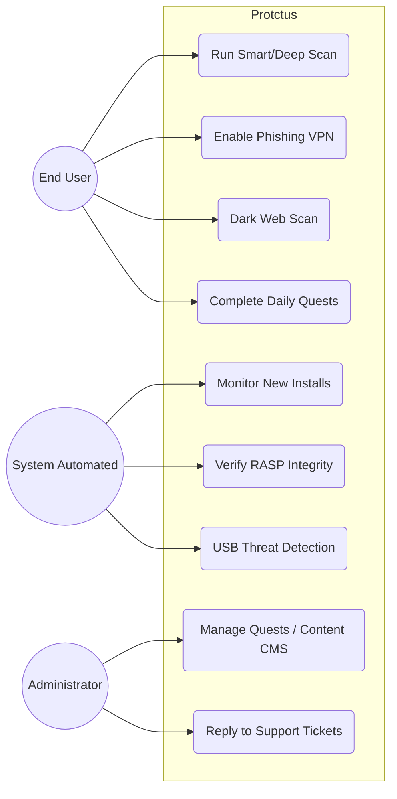

```mermaid
graph LR
    User((End User))
    System((System Automated))
    Admin((Administrator))

    subgraph Protctus
        UC1(Run Smart/Deep Scan)
        UC2(Enable Phishing VPN)
        UC3(Dark Web Scan)
        UC4(Complete Daily Quests)
        UC5(Monitor New Installs)
        UC6(Verify RASP Integrity)
        UC7(USB Threat Detection)
        UC8(Manage Quests / Content CMS)
        UC9(Reply to Support Tickets)
    end

    User --> UC1
    User --> UC2
    User --> UC3
    User --> UC4

    System --> UC5
    System --> UC6
    System --> UC7

    Admin --> UC8
    Admin --> UC9
```
