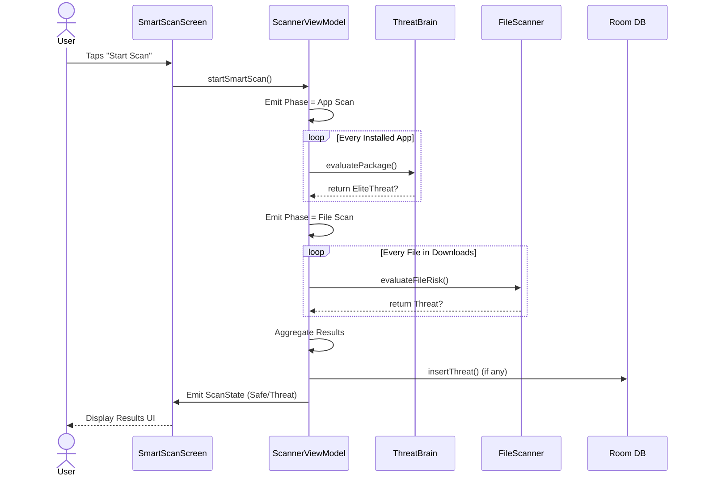

```mermaid
sequenceDiagram
    actor User
    participant View as SmartScanScreen
    participant VM as ScannerViewModel
    participant TB as ThreatBrain
    participant FS as FileScanner
    participant DB as Room DB

    User->>View: Taps "Start Scan"
    View->>VM: startSmartScan()
    VM->>VM: Emit Phase = App Scan

    loop Every Installed App
        VM->>TB: evaluatePackage()
        TB-->>VM: return EliteThreat?
    end

    VM->>VM: Emit Phase = File Scan

    loop Every File in Downloads
        VM->>FS: evaluateFileRisk()
        FS-->>VM: return Threat?
    end

    VM->>VM: Aggregate Results
    VM->>DB: insertThreat() (if any)
    VM->>View: Emit ScanState (Safe/Threat)
    View-->>User: Display Results UI
```
