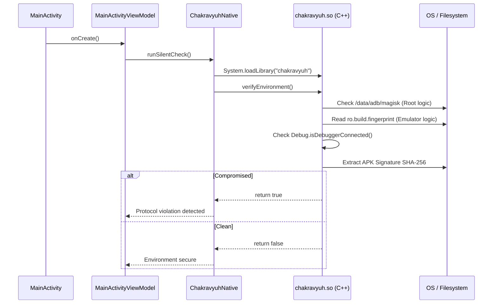

```mermaid
sequenceDiagram
    participant App as MainActivity
    participant VM as MainActivityViewModel
    participant Bridge as ChakravyuhNative
    participant JNI as chakravyuh.so (C++)
    participant OS as OS / Filesystem

    App->>VM: onCreate()
    VM->>Bridge: runSilentCheck()
    Bridge->>JNI: System.loadLibrary("chakravyuh")
    Bridge->>JNI: verifyEnvironment()

    JNI->>OS: Check /data/adb/magisk (Root logic)
    JNI->>OS: Read ro.build.fingerprint (Emulator logic)
    JNI->>JNI: Check Debug.isDebuggerConnected()
    JNI->>OS: Extract APK Signature SHA-256

    alt Compromised
        JNI-->>Bridge: return true
        Bridge-->>VM: Protocol violation detected
    else Clean
        JNI-->>Bridge: return false
        Bridge-->>VM: Environment secure
    end
```
