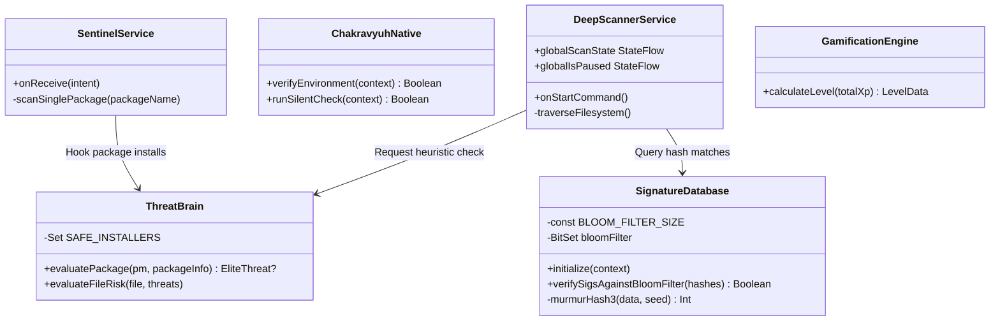

```mermaid
classDiagram
    class ThreatBrain {
        -Set SAFE_INSTALLERS
        +evaluatePackage(pm, packageInfo) EliteThreat?
        +evaluateFileRisk(file, threats)
    }

    class SignatureDatabase {
        -const BLOOM_FILTER_SIZE
        -BitSet bloomFilter
        +initialize(context)
        +verifySigsAgainstBloomFilter(hashes) Boolean
        -murmurHash3(data, seed) Int
    }

    class DeepScannerService {
        +globalScanState StateFlow
        +globalIsPaused StateFlow
        +onStartCommand()
        -traverseFilesystem()
    }

    class ChakravyuhNative {
        +verifyEnvironment(context) Boolean
        +runSilentCheck(context) Boolean
    }

    class SentinelService {
        +onReceive(intent)
        -scanSinglePackage(packageName)
    }

    class GamificationEngine {
        +calculateLevel(totalXp) LevelData
    }

    DeepScannerService --> ThreatBrain : Request heuristic check
    DeepScannerService --> SignatureDatabase : Query hash matches
    SentinelService --> ThreatBrain : Hook package installs
```
